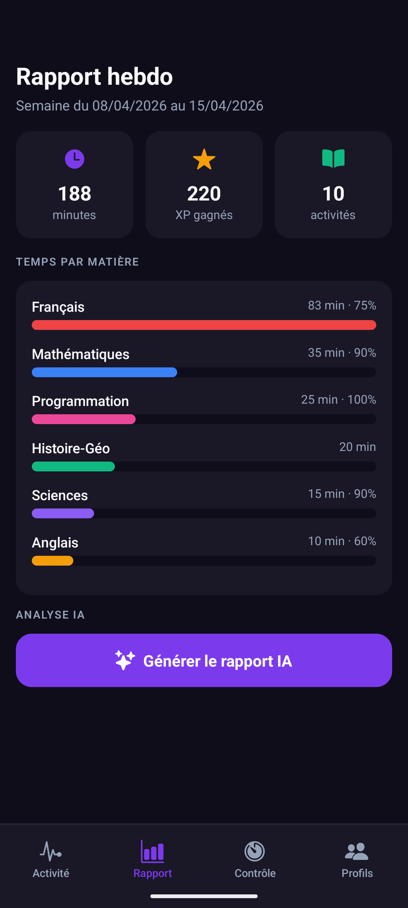
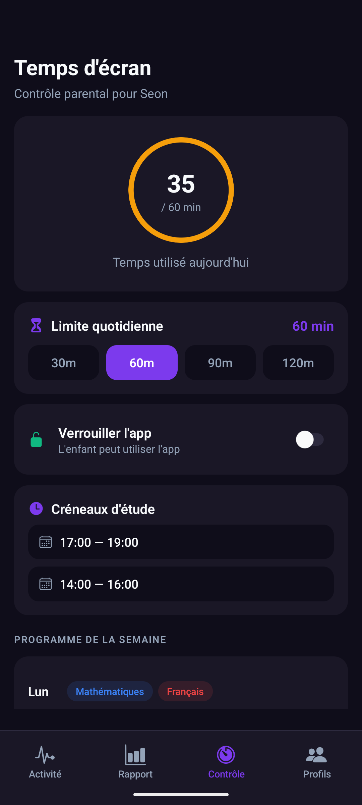
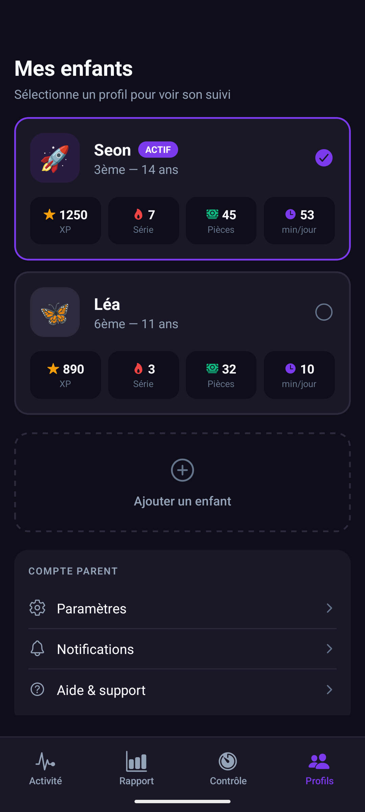
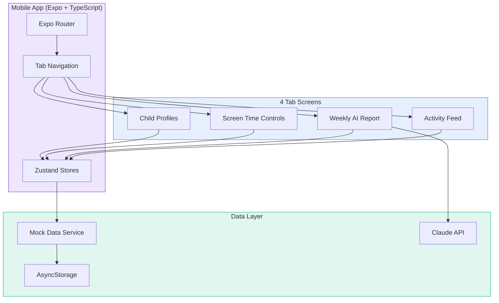
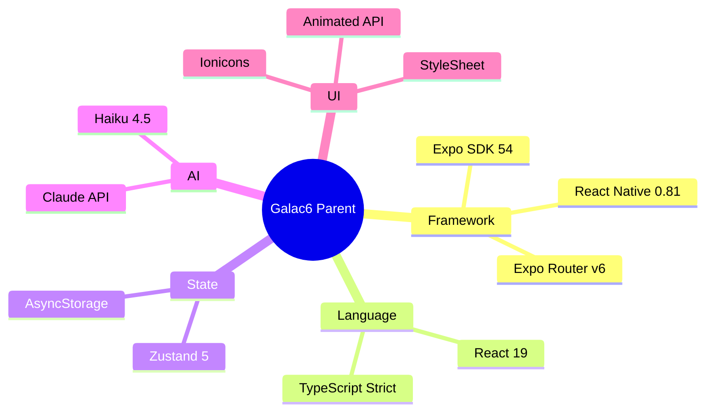
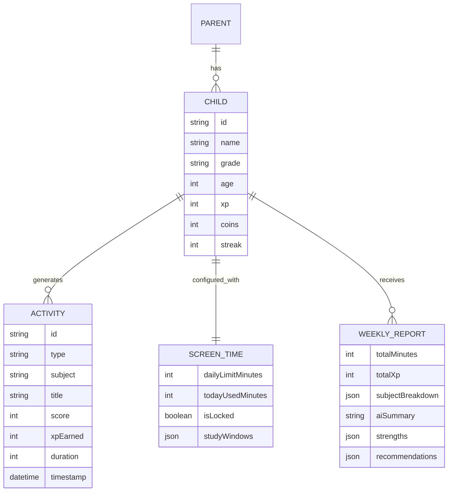

# Galac6 Parent

Mobile companion app for parents to track their child's AI-tutored learning on Galac6 — the French Socratic EdTech platform.


## Screenshots

<p align="center">
  
  &nbsp;&nbsp;
  
  &nbsp;&nbsp;
  
  &nbsp;&nbsp;
  
</p>

<p align="center">
  <em>Activity Feed &nbsp;|&nbsp; AI Weekly Report &nbsp;|&nbsp; Screen Time Controls &nbsp;|&nbsp; Child Profiles</em>
</p>

## About

Galac6 is an AI-powered tutoring platform for French students (CP to Terminale) that uses the Socratic method — guiding students to find answers rather than giving them directly. The web platform includes quizzes, dictation, mock exams (Brevet), coding courses, and curriculum-aligned study sheets.

**Galac6 Parent** fills a critical gap: while students have a rich learning experience, parents currently lack visibility into their child's progress. This app gives parents real-time activity tracking, AI-generated weekly reports, and screen time controls — all from their phone.

## Architecture



## Features

### Activity Feed

- Real-time cards showing child's learning sessions
- Subject color-coded badges (Maths, French, Science, etc.)
- Score percentages, XP earned, and session duration
- Pull-to-refresh with animated notification banners

### Weekly AI Report

- AI-generated learning analysis powered by Claude API
- Subject breakdown with progress bars and average scores
- Personalized strengths, improvement areas, and actionable recommendations

### Screen Time Controls

- Visual progress ring showing daily usage vs limit
- Quick-set buttons (30m / 60m / 90m / 120m)
- App lock toggle with status indicator
- Weekly study planner with subject assignments per day

### Child Profiles

- Multi-child support with profile switcher
- Per-child stats: XP, streak, coins, daily minutes
- Active profile indicator across all tabs

### Onboarding

- 4-step welcome flow: Welcome, Name, Grade, Confirmation
- Grade picker covering CP through Terminale

### In-App Notifications

- Animated slide-in banner simulating push notifications
- Auto-dismisses after 4 seconds

## Tech Stack



## Project Structure

```
galac6-parent/
├── app/
│   ├── _layout.tsx              # Root layout
│   ├── onboarding.tsx           # 4-step welcome flow
│   └── (tabs)/
│       ├── _layout.tsx          # Tab bar configuration
│       ├── index.tsx            # Activity Feed
│       ├── report.tsx           # Weekly AI Report
│       ├── controls.tsx         # Screen Time + Schedule
│       └── profile.tsx          # Child Profiles
├── components/
│   ├── ActivityCard.tsx         # Activity feed card
│   └── NotificationBanner.tsx   # Animated notification
├── services/
│   └── claude.ts                # Claude API + mock report
├── stores/
│   ├── childStore.ts            # Child profiles state
│   ├── activityStore.ts         # Activity feed state
│   └── controlsStore.ts        # Screen time + schedule
├── constants/
│   ├── colors.ts                # Galac6 brand palette
│   ├── subjects.ts              # French curriculum data
│   ├── styles.ts                # Shared StyleSheet
│   └── mockActivities.ts       # Realistic seed data
├── types/
│   └── index.ts                 # All TypeScript types
└── docs/
    ├── PRD.md                   # Product Requirements
    └── BRAINSTORM.md            # Ideation session
```

## Getting Started

### Prerequisites

- Node.js 18+
- Expo Go app on your phone ([Android](https://play.google.com/store/apps/details?id=host.exp.exponent) / [iOS](https://apps.apple.com/app/expo-go/id982107779))

### Install

```bash
git clone https://github.com/soneeee22000/galac6-parent.git
cd galac6-parent
npm install --legacy-peer-deps
```

### Environment

```bash
cp .env.example .env
# Add your Anthropic API key for real AI reports (optional)
```

### Run

```bash
npx expo start
# Scan QR code with Expo Go on your phone
# Or press 'w' for web, 'a' for Android emulator
```

## Data Model



## Design Decisions

| Decision   | Choice                            | Why                                                                                          |
| ---------- | --------------------------------- | -------------------------------------------------------------------------------------------- |
| Styling    | React Native StyleSheet           | NativeWind had compatibility issues with Expo SDK 54; StyleSheet is zero-config and reliable |
| State      | Zustand                           | Minimal boilerplate, TypeScript-first, no providers needed                                   |
| Navigation | Expo Router                       | File-based routing, type-safe, built into Expo                                               |
| AI Reports | Claude Haiku 4.5                  | Fast, cheap, good enough for structured report generation                                    |
| Mock Data  | In-memory with realistic patterns | No backend access; mock service mirrors real Galac6 activity types                           |

## Galac6 Ecosystem

This app complements the existing Galac6 web platform:

| Platform              | What It Does                                   | Status        |
| --------------------- | ---------------------------------------------- | ------------- |
| galac6.io             | Marketing site                                 | Live          |
| galac6web.netlify.app | Student tutoring (Socratic AI, quizzes, exams) | Live (beta)   |
| **Galac6 Parent**     | **Parent tracking + controls**                 | **Prototype** |
| Galac6 Mobile Student | Student app                                    | Roadmap       |
| Galac6 IoT Device     | Screen-free voice tutor                        | Concept       |

## Author

**Pyae Sone (Seon)** — AI Engineer at [Ekkhara](https://ekkhara.com), Station F Paris

## License

MIT
